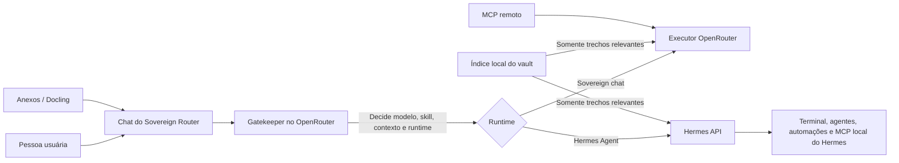

# Guia completo de uso — Sovereign Router

Este guia descreve o Sovereign Router como ponto central de conversa, contexto e governança de IA dentro do Obsidian. Ele explica o que o plugin faz, como configurar cada integração e quando usar cada caminho de execução.

> **Princípio do produto:** o Sovereign Router não tenta executar tudo dentro do Obsidian. Ele centraliza a decisão, o contexto e a visibilidade. O chat usa OpenRouter; ações complexas podem ser delegadas ao Hermes Agent; documentos podem ser convertidos pelo Docling; e serviços externos podem ser chamados por MCP remoto.

## 1. Visão geral



O fluxo normal é:

1. Você envia uma mensagem.
2. O **Gatekeeper** classifica a tarefa e decide qual modelo permitido deverá atendê-la. Quando necessário, ele também pede uma skill, trechos do vault ou o runtime Hermes.
3. O Sovereign Router valida a decisão. Modelos fora da lista permitida, skills inseguras e rotas inválidas são recusados.
4. A tarefa segue para o chat do OpenRouter ou para o Hermes Agent.
5. A resposta aparece no painel com o modelo efetivamente usado, custo informado pela API e indicação de cache quando disponível.

## 2. O que o plugin faz — e o que não faz

| Capacidade | Onde acontece | Observação |
| --- | --- | --- |
| Conversa com múltiplos modelos | Sovereign chat / OpenRouter | Histórico existe apenas enquanto o painel está aberto. |
| Seleção automática de modelo | Gatekeeper | Restrita à lista de modelos autorizados. |
| Leitura contextual do vault | Local, no Obsidian | O índice é local; apenas trechos relevantes são enviados. |
| Skills locais e do GitHub | Sovereign chat | Skills são texto/instrução, nunca código executável. |
| Conversão de PDF e Office | Serviço Docling opcional | O arquivo é enviado apenas ao serviço configurado. |
| Ferramentas MCP remotas | Sovereign chat | Apenas Streamable HTTP; escrita exige autorização. |
| Terminal, subagentes e automações | Hermes Agent externo | Hermes é instalado e protegido separadamente. |
| Execução de código remoto | Não suportada pelo plugin | O plugin não baixa nem executa scripts remotos. |
| Edição automática de notas | Não suportada na v1 | MCP ou Hermes só podem escrever se você os configurar e aprovar. |
| Telemetria | Não coletada | Não há envio oculto de métricas ou conversas. |

## 3. Instalação e primeiro acesso

### Instalação local

1. Gere a versão de produção do plugin.
2. Copie `main.js`, `manifest.json` e `styles.css` para:

   ```text
   <seu-vault>/.obsidian/plugins/sovereign-router/
   ```

3. No Obsidian, abra **Settings → Community plugins**.
4. Recarregue os plugins da comunidade e habilite **Sovereign Router**.
5. Abra o painel por meio do comando **Sovereign Router: Open chat** (ou pelo ícone/painel registrado pelo Obsidian).

### Configuração mínima para conversar

1. Abra **Settings → Sovereign Router**.
2. Em **OpenRouter API key**, crie ou selecione a referência para sua chave.
3. Mantenha os modelos padrão ou escolha os seus modelos permitidos.
4. Abra o chat, escreva uma pergunta e envie com **Enter**. Use `Shift+Enter` para quebrar linha.

As chaves são tratadas pelo **Obsidian SecretStorage**. O `data.json` do plugin armazena somente a referência/nome do segredo, nunca o valor da chave.

## 4. Modelos, Gatekeeper e política de roteamento

### Modelos disponíveis por padrão

| Modelo | Identificador OpenRouter | Uso típico |
| --- | --- | --- |
| DeepSeek V4 Flash | `deepseek/deepseek-v4-flash` | Triagem, resumos rápidos, texto e conversa geral. |
| DeepSeek V4 Pro | `deepseek/deepseek-v4-pro` | Raciocínio, arquitetura, código e algoritmos. |
| Qwen 3.7 Max | `qwen/qwen3.7-max` | Planejamento e análise de múltiplos documentos. |
| Qwen 3.7 Plus | `qwen/qwen3.7-plus` | Análise visual e documentos estruturados. |
| Kimi K2.7 Code | `moonshotai/kimi-k2.7-code` | Engenharia de software e trabalho agêntico. |
| Grok 4.3 | `x-ai/grok-4.3` | Pesquisa factual e assuntos recentes. |

O padrão do plugin usa **DeepSeek V4 Flash** como Gatekeeper e **Kimi K2.7 Code** como executor de fallback.

### Como o Gatekeeper decide

O Gatekeeper recebe a sua mensagem e uma instrução de roteamento. Ele precisa devolver apenas um objeto JSON no formato abaixo:

```json
{
  "model": "modelo/autorizado",
  "runtime": "chat",
  "skill": null,
  "context": null
}
```

Ele pode, opcionalmente, solicitar uma skill local ou remota e um contexto focado do vault. O Router só aceita a decisão se:

- o modelo estiver em **Permitted executor models**;
- a skill local estiver em uma pasta configurada e usar caminho relativo seguro;
- a skill GitHub vier de um repositório explicitamente permitido;
- o contexto pedir uma busca específica no vault;
- o Hermes estiver habilitado quando o runtime solicitado for `hermes`.

Se a resposta do Gatekeeper for inválida, se a rede falhar ou se ele selecionar algo não autorizado, a conversa continua com o **Default executor model**, sem skill. O painel mostra uma nota discreta explicando o fallback.

### Configurações de modelo

- **Gatekeeper model:** modelo leve para classificar e rotear a tarefa.
- **Default executor model:** alternativa segura quando não houver rota válida.
- **Permitted executor models:** um slug por linha. São os únicos modelos que o Gatekeeper pode escolher automaticamente.
- **Manual-only models:** modelos disponíveis no seletor manual, mas proibidos para roteamento automático.
- **Routing instruction:** regra adicional de roteamento. Não remova o requisito de JSON estrito.

Para escolher manualmente, altere o seletor de modelo no cabeçalho do chat. A escolha manual prevalece sobre o Gatekeeper para aquela sessão.

### Catálogo de modelos e custos

O painel de configurações pode atualizar o catálogo oficial do OpenRouter. O catálogo contém metadados não sensíveis, como modalidades, janela de contexto, suporte a ferramentas e preços de referência.

- Ele é atualizado quando o Obsidian está aberto e a cópia local está mais antiga que o intervalo configurado (15 dias por padrão).
- Atualizar o catálogo **não** torna um modelo automaticamente roteável.
- Inclua um slug em **Manual-only models** para apenas selecioná-lo no chat.
- Inclua um slug em **Permitted executor models** somente após aprová-lo para roteamento automático.
- O custo exibido depois de uma resposta não é estimado: vem do campo `usage.cost` devolvido pelo OpenRouter.

## 5. Conversa, sessões e FinOps

Cada painel de chat mantém uma sessão efêmera:

- mensagens anteriores são usadas como histórico enquanto o painel estiver aberto;
- fechar o painel encerra esse histórico; ele não é salvo como nota nem em arquivo de conversa;
- **Cancel** interrompe a solicitação atual; em uma execução Hermes, também solicita a interrupção do run remoto;
- falhas 401/403, 429 e 5xx são apresentadas com orientação acionável.

No cabeçalho de cada resposta, o Router pode mostrar:

- modelo efetivamente utilizado;
- custo em USD, quando a API o informa;
- `cache hit`, quando a API informa tokens de prompt reutilizados;
- uma nota de fallback, contexto, MCP ou execução Hermes quando pertinente.

O **Sovereign control center** agrega apenas os custos reais recebidos na vida atual do plugin. Esse total é apagado quando o Obsidian descarrega o plugin e não inclui mensagens, prompts, arquivos ou telemetria.

## 6. Contexto automático do vault

O Router não envia o vault inteiro em todas as mensagens. Essa é uma decisão de privacidade, custo e qualidade de resposta.

### Como funciona

1. Depois que o Obsidian termina de carregar, o plugin cria e atualiza um índice local dos arquivos de texto suportados.
2. Esse índice guarda referência de arquivo, marcadores de alteração, títulos e termos de busca; não cria uma segunda cópia integral das notas.
3. Quando o Gatekeeper entende que a pergunta precisa do vault, pede uma consulta curta e específica.
4. O Router relê os arquivos atuais mais relevantes, extrai trechos limitados e só então os envia ao modelo escolhido.
5. Sem índice, sem resultado ou com índice desatualizado, a conversa segue sem contexto de vault.

### Uso recomendado

Pergunte de forma explícita, por exemplo:

```text
Com base nas minhas notas de projeto, quais decisões pendentes aparecem no plano de lançamento?
```

ou:

```text
Compare os requisitos mencionados nas notas sobre autenticação e faça uma lista de conflitos.
```

O Gatekeeper decide se o contexto é necessário; não há uma opção para transformar todo o vault em pre-contexto permanente.

### Documentos externos no contexto

Documentos enviados diretamente são convertidos para Markdown e entram na biblioteca local de contexto. Isso permite que sejam recuperados em conversas futuras pertinentes, até que você use **Clear stored external documents** nas configurações.

O cache contém o Markdown convertido. Portanto, trate anexos externos como dados persistentes locais até removê-los. Arquivos originais não são copiados para o vault pelo plugin.

## 7. Skills

Skills são instruções em Markdown que orientam o modelo em uma tarefa. Elas não são plugins, executáveis ou ferramentas.

### Skills locais

Por padrão, o Router procura, nessa ordem:

1. `05 Skills/Métodos`
2. `05 Skills`
3. `03 Projects/Héstia/05 Skills`

Você pode alterar essas pastas em **Local skill folders**, uma por linha. Elas são sempre relativas ao vault. Caminhos absolutos, `..` e outras formas de travessia são rejeitados.

### Skills GitHub

Para permitir uma skill remota:

1. Em **Allowed GitHub repositories**, inclua `proprietario/repositorio` em uma linha.
2. Peça ou ajuste a instrução de roteamento para que o Gatekeeper possa selecionar uma skill daquele repositório.
3. O Router baixa somente o Markdown solicitado e não o grava no vault.

Skills de repositórios não permitidos são bloqueadas. Use apenas repositórios confiáveis, pois o conteúdo da skill influencia as instruções enviadas ao modelo.

## 8. Anexos, pastas e Docling

### O que é o Docling aqui

Docling é um projeto Python. Para preservar compatibilidade mobile e não incluir um runtime pesado no plugin, o Router conversa com uma instância externa do **docling-serve** por API.

### Configurar

1. Instale e inicie um serviço Docling separado. Exemplo de comando no ambiente onde o serviço será executado:

   ```text
   docling-serve run
   ```

2. Em **Settings → Sovereign Router**, preencha **Docling service URL**.
3. Use HTTPS para um serviço remoto. HTTP é aceito somente quando o serviço está no próprio dispositivo, como `http://localhost:5001`.
4. Se o serviço exigir chave, selecione a referência em **Docling API key**.

Em celular, `localhost` é o próprio telefone/tablet, e não o computador. Use uma URL HTTPS acessível pelo dispositivo, ou execute o Docling no próprio aparelho.

### Anexar documento

Selecione **Attach document** no chat. O conteúdo convertido fica disponível imediatamente na sessão atual e também pode ser recuperado futuramente pela biblioteca local de contexto.

### Anexar pasta do vault

Selecione **Attach vault folder**. O Router percorre a pasta selecionada recursivamente:

- texto e Markdown são lidos via API do Vault;
- PDF, DOCX, PPTX, XLSX, ODT, ODS, ODP e EPUB são enviados ao Docling;
- a importação aceita até 25 documentos por pasta;
- cada upload é limitado a 20 MB;
- o Markdown injetado é limitado para proteger contexto e custo.

PDFs e arquivos Office já existentes no vault não são convertidos automaticamente pelo índice. Anexe-os com Docling quando precisar que seu conteúdo seja interpretado.

## 9. MCP remoto

O Router consome servidores MCP usando somente o transporte **Streamable HTTP**. Ele não inicia processos nem usa MCP `stdio` local dentro do Obsidian.

### Conectar um servidor

1. Abra **Settings → Sovereign Router → MCP connections**.
2. Selecione **Add connection**.
3. Informe um nome, a URL do endpoint e, se necessário, uma referência de segredo.
4. Habilite a conexão.
5. No chat, marque **MCP** antes de enviar a mensagem que pode usar as ferramentas.

O endpoint deve usar HTTPS. HTTP é aceito apenas em `localhost`/loopback.

### Política de segurança

- ferramentas declaradas como somente leitura pelo servidor podem rodar em um chat com MCP habilitado;
- ferramentas de escrita ficam bloqueadas por padrão;
- mesmo quando você habilita **Allow write tools**, cada chamada de escrita exibe argumentos e exige confirmação;
- o Router carrega a lista de ferramentas apenas para a mensagem atual com MCP habilitado;
- resultados de ferramentas e detalhes de sessão não são persistidos pelo Router.

Confie apenas em servidores MCP conhecidos. A declaração de “somente leitura” vem do próprio servidor, portanto não substitui a sua avaliação de segurança.

## 10. Hermes Agent: tarefas complexas e automações

O Hermes é o runtime para tarefas que ultrapassam uma conversa: terminal, subprocessos, subagentes, ciclos de ferramentas, MCP local, tarefas agendadas e aprovações de comandos perigosos.

O Sovereign Router **não instala, inicia ou administra o processo Hermes**. Ele apenas conversa com uma API Hermes já configurada e apresenta o andamento no Obsidian.

### Configurar a conexão

1. Instale e configure o Hermes separadamente, incluindo sua API server e chave.
2. Mantenha a API em loopback (`127.0.0.1`) ou protegida por HTTPS autenticado.
3. Em **Settings → Sovereign Router**, preencha **Hermes API URL** e selecione **Hermes API key** no SecretStorage.
4. Abra **Sovereign Router: Open control center** e use **Test connection**.

O Router aceita URL HTTPS ou HTTP somente em loopback. A chave é necessária mesmo para uma API local.

### Escolher o runtime

No cabeçalho do chat:

- **Sovereign chat:** conversa normal com OpenRouter, contexto de vault, skills e MCP remoto.
- **Hermes Agent:** envia a tarefa ao Hermes. Use para execução, automação e tarefas com ferramentas.
- **Auto runtime:** o Gatekeeper escolhe Hermes somente se **Allow automatic Hermes routing** estiver ligado. Sem essa opção, uma escolha automática por Hermes volta ao chat.

A escolha manual é sempre prioritária.

### O que o Hermes recebe

O Router envia a sua solicitação e, quando aplicável, as instruções de skill, documentos anexados e trechos relevantes do vault. Ele não envia chaves secretas do Router.

O Hermes é responsável por suas próprias permissões de terminal, arquivos, subagentes, ferramentas e comandos perigosos. Configure essas regras no Hermes; o Router não deve ser tratado como substituto de sua política de segurança.

### Automações no Control Center

Quando a API Hermes disponibiliza jobs, o Control Center permite:

- listar automações;
- criar uma automação com nome, agenda e prompt autossuficiente;
- alterar nome, agenda, perfil de provedor e skills permitidas;
- executar uma vez;
- pausar, retomar ou remover.

Cada operação de executar, pausar, retomar ou excluir exige confirmação no Obsidian. O prompt de uma automação é enviado diretamente ao Hermes e o Router não o armazena nem o reexibe.

Em **Permitted Hermes provider overrides**, inclua somente os perfis de provedor já configurados e confiáveis no Hermes, um por linha. Se a lista estiver vazia, o Router exige o provedor padrão do runtime Hermes. O modelo efetivo é definido pelo Hermes; qualquer modelo informado pela API é apenas informativo no painel.

### Exemplo: pesquisa e enriquecimento periódico

Crie uma automação Hermes com uma agenda de seis em seis horas, por exemplo usando a sintaxe de agenda aceita pela sua instalação Hermes. O prompt deve ser completo e conter:

```text
Pesquise fontes oficiais e confiáveis sobre <tema>. Compare com a base de dados disponível,
extraia somente os novos fatos verificáveis, informe as URLs e datas de cada fonte, e produza
uma proposta de atualização. Não aplique mudanças nem execute comandos destrutivos sem pedir
aprovação no runtime Hermes.
```

Use um provedor/modelo econômico configurado no Hermes para a triagem inicial e reserve modelos mais caros para casos que exigirem síntese profunda. A aprovação e a escrita final continuam sob a política do Hermes.

## 11. Sovereign Control Center

Abra pelo comando **Sovereign Router: Open control center** ou pelo botão **Control** no cabeçalho do chat.

Ele é o painel de operação do sistema e mostra:

- se as credenciais do OpenRouter foram selecionadas;
- situação da conexão Hermes e suporte a jobs;
- estado do índice de contexto do vault;
- quantidade de documentos externos em cache;
- conexões MCP ativas e permissões de escrita;
- data e tamanho do catálogo de modelos;
- custos FinOps reais acumulados enquanto o plugin está carregado.

O painel serve para governar e observar. Ele deliberadamente não oferece terminal, acesso irrestrito a arquivos ou MCP `stdio` local dentro do Obsidian.

## 12. Privacidade e segurança

### Dados enviados

| Destino | Dados enviados quando usado |
| --- | --- |
| OpenRouter | Mensagem, histórico temporário, skill selecionada, trechos relevantes do vault, documento convertido e esquemas/resultados MCP necessários. |
| Docling configurado | Arquivo anexado que precisa de conversão e, opcionalmente, a chave desse serviço. |
| Servidor MCP | Argumentos da ferramenta que o modelo solicita e que a política permite. |
| Hermes | Prompt e contexto selecionado para uma sessão Hermes ou prompt de automação. |

### Dados persistidos localmente

- configurações e referências de segredos;
- índice do vault: caminhos, marcadores, títulos e termos de busca;
- Markdown convertido de documentos externos, até ser removido;
- catálogo não sensível de modelos.

Não são persistidos pelo Router: a chave de API em texto, conversa completa, histórico de chat, telemetria, cópia integral das notas indexadas, código remoto ou arquivos anexados originais.

### Checklist de proteção

1. Use serviços remotos apenas por HTTPS.
2. Mantenha Docling, MCP e Hermes em loopback quando forem locais; não exponha portas na internet sem autenticação e camada de rede adequada.
3. Use segredos diferentes para OpenRouter, Docling, MCP e Hermes.
4. Autorize apenas repositórios de skills e servidores MCP confiáveis.
5. Mantenha ferramentas MCP de escrita desabilitadas até precisar delas.
6. Revise o prompt e a agenda de cada automação Hermes antes de ativá-la.
7. Limpe documentos externos armazenados quando não forem mais necessários.

## 13. Solução de problemas

| Sintoma | O que verificar |
| --- | --- |
| Chat não envia | Selecione uma chave OpenRouter no SecretStorage e confirme conectividade. |
| Modelo inesperado | Revise o seletor manual, a lista de executores permitidos e a nota de fallback na resposta. |
| Vault não foi usado | Faça uma pergunta específica sobre o vault e espere o índice local terminar; o Router não envia o vault inteiro por padrão. |
| Documento não converte | Confira URL do Docling, conectividade do dispositivo, chave opcional, formato, limite de 20 MB e se não é HTTP remoto. |
| Pasta não importou tudo | Há limite de 25 documentos; confirme que arquivos são suportados. |
| MCP indisponível | Habilite a conexão, marque **MCP** no chat e verifique se a URL usa HTTPS ou loopback. |
| MCP não escreve | Ative **Allow write tools** e aceite a confirmação da chamada. |
| Hermes indisponível | Verifique URL, segredo, se o serviço está em execução e use **Test connection** no Control Center. |
| Auto não usou Hermes | Ative **Allow automatic Hermes routing**; ou selecione **Hermes Agent** manualmente. |
| Automação Hermes não aparece | O servidor Hermes pode não anunciar suporte à API de jobs; teste a conexão e atualize o Hermes. |
| Custo não aparece | O provedor pode não ter enviado `usage.cost`; o Router não inventa estimativas. |

## 14. Rotina recomendada

### Todo dia

1. Use **Sovereign chat** para análise, escrita, decisões e consultas ao vault.
2. Selecione manualmente um modelo quando souber que a tarefa exige uma especialidade.
3. Anexe documentos somente quando necessários e limpe material externo sensível após o uso.

### Quando a tarefa exigir ação

1. Selecione **Hermes Agent** ou habilite o Auto runtime conscientemente.
2. Defina um objetivo, limites e critério de encerramento claros.
3. Revise as aprovações no Hermes antes de permitir escrita, terminal ou comandos perigosos.

### A cada 15 dias

1. Atualize o catálogo de modelos no Control Center ou use a automação de catálogo incluída em `hermes-automation/`.
2. Revise preços, modalidades e modelos novos.
3. Decida quais entram apenas como manuais e quais podem ser executores automáticos.
4. Revise conexões MCP, skills GitHub permitidas e automações Hermes.

## 15. Materiais relacionados

- [README.md](README.md): visão resumida do projeto e instalação de desenvolvimento.
- [TESTING_GUIDE.md](TESTING_GUIDE.md): roteiro de testes automatizados e manuais.
- [HERMES_OPERATING_MODEL.md](HERMES_OPERATING_MODEL.md): modelo operacional e arquitetura da integração Hermes.
- [hermes-automation/README.md](hermes-automation/README.md): automação de pesquisa de catálogo de modelos.
- [mcp-connectors/README.md](mcp-connectors/README.md): conector MCP Streamable HTTP de referência.

## Limites intencionais da versão atual

- O plugin não é um terminal e não tenta substituir o Hermes.
- Não há persistência automática de conversas.
- Não existe sincronização automática de skills para o vault.
- O vault não é enviado integralmente como contexto permanente.
- Modelos descobertos pelo catálogo não ganham permissão automática.
- A conversão Docling precisa de um serviço externo configurado.
- MCP local via `stdio` pertence ao Hermes, não ao plugin mobile-first.

Esses limites mantêm o plugin mais leve, mobile-friendly e previsível quanto a custo, dados e permissões.
